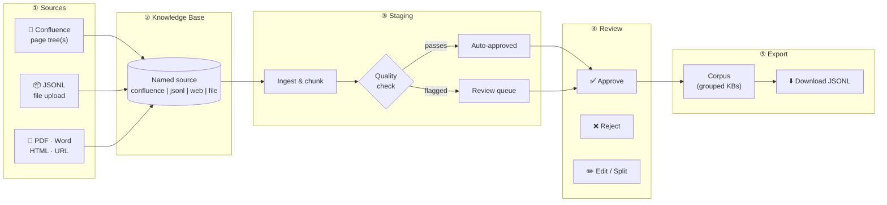
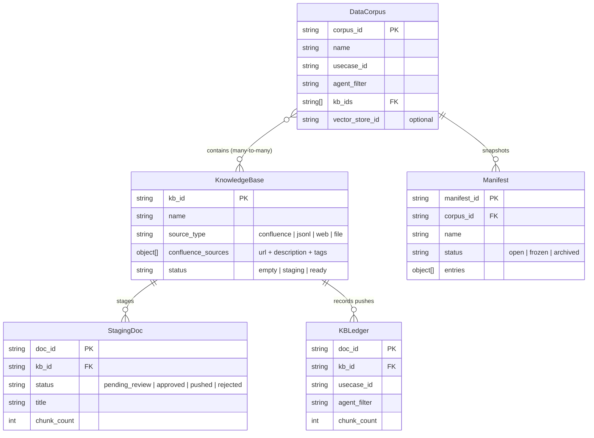
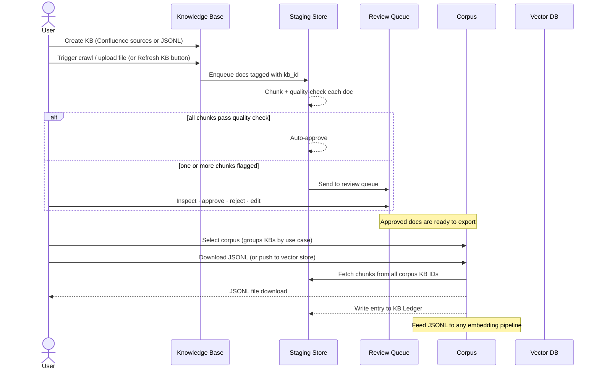

# Knowledge Ingestion Pipeline

A tool for preparing and managing AI knowledge base content. It takes documents from various sources — Confluence wikis, PDFs, Word files, web pages, JSONL exports — converts them into clean, reviewable chunks, and lets you download the results as JSONL for use in any downstream system.



---

## What problem does this solve?

Building reliable AI knowledge bases is harder than it looks. Raw documents have noise: navigation menus, empty headings, stale pages, boilerplate footers. Without a review step, all of that ends up in your context windows.

This pipeline adds structure around content preparation:

- **Review before export** — nothing goes into your JSONL until a human (or the quality checker) has signed off
- **Track everything** — every document has a record: what was ingested, when, from which source, for which corpus
- **Detect drift** — for Confluence sources, the system flags pages that have changed since the last crawl
- **Scope by corpus** — group Knowledge Bases into named corpora; download all their content as a single JSONL in one click
- **Vector DB optional** — the primary output is JSONL you can feed to any embedding pipeline; pushing to a vector store is an optional advanced step

---

## Data Model

### Knowledge Base

A named source of documents. Four types:

- **Confluence** — one or more registered page trees, each with an optional description and tags; the built-in crawler fetches the full tree for all registered sources
- **JSONL** — a manually uploaded `.jsonl` file
- **Web** — output from an external web crawler delivered as JSONL; the pipeline does not crawl, you bring the data
- **File** — PDFs, DOCX, HTML, and other documents uploaded via the Add Document page

A Knowledge Base has no use case or agent context — it is purely a source container. One KB can belong to many corpora.

### Confluence Sources

Each Confluence KB stores a list of sources, not just a single URL:

```json
{
  "url": "https://company.atlassian.net/wiki/spaces/OPS/pages/123/Runbooks",
  "description": "Operational runbooks",
  "tags": ["ops", "runbooks"]
}
```

Tags are applied to every page crawled from that source. The KB page lets you add, remove, and refresh sources independently.

### Data Corpus

A named collection of Knowledge Bases. The corpus carries:

- `usecase_id` — the business use case this content supports (optional)
- `agent_filter` — the specific AI agent or persona this content is for (optional)

Download all staged content from a corpus's KBs as a single JSONL file from the **Export** tab. Pushing to a vector store is an optional advanced step.

### Staging Store

A holding area for documents before they are exported. Documents are scoped to a Knowledge Base (`kb_id`). The review queue lets you inspect, edit, approve, or reject staged documents before exporting.

### Manifest

A frozen, corpus-scoped snapshot of all staged/pushed documents at a point in time. Manifests let you:

- Record exactly which sources were in a corpus at a given version
- Diff two manifests to see what changed
- Re-ingest all Confluence sources from a saved manifest

### KB Ledger

A permanent record of every document push. Each entry records which KB it came from, which corpus it was pushed for, and the chunk count and drift status.

---

## Data model relationships



---

## How a document moves through the system



---

## Quick Start

### Prerequisites

| Service | Purpose | Local Docker |
|---|---|---|
| MongoDB 7+ | Staging queue + knowledge base ledger | `docker run -p 27017:27017 mongo:7` |
| Redis Stack | Vector search index | `docker run -p 6379:6379 redis/redis-stack-server:latest` |

### Install

```bash
git clone <repo-url>
cd knowledge-ingestment-pipeline

# Recommended — uses uv
uv sync --python python3.13

# Or plain pip
pip install -e .
```

### Configure

```bash
cp .env.example .env   # macOS / Linux
copy .env.example .env # Windows
```

Edit `.env` and set at minimum:

```env
OPENAI_API_KEY=sk-...
MONGODB_URI=mongodb://localhost:27017
MONGODB_TLS=false        # for a plain local MongoDB
REDIS_URL=redis://localhost:6379
```

See [Configuration reference](#configuration-reference) for all options.

### Run

```bash
streamlit run app.py
```

Open `http://localhost:8501` in your browser.

---

## How it works — the UI

### Dashboard

The first thing you see. Shows how many documents are waiting for review, approved and ready to push, and already live in the knowledge base. Quick links to the most common tasks.

---

### Knowledge Bases

Create and manage knowledge bases — the sources that feed your corpora.

**Confluence KB** — register one or more parent page URLs, each with an optional description and tags. The KB detail page shows all registered sources in a table; you can add, remove, and re-order them. Hit **🔄 Refresh KB** to clear the current staged content and re-crawl all sources in one click. Source URLs, descriptions, and tags are stored per-entry so different page trees can carry different metadata.

**JSONL KB** — upload a `.jsonl` file (one JSON object per line). The importer auto-detects the data format and shows a preview before importing. Custom field mappings let you import from any source without changing your data.

**Web KB** — for content produced by any external web crawler. The pipeline does not crawl; you run your own crawler, export the results as JSONL, and import that file on the **Add Document** page pointing at this KB. The following URL field names are recognised automatically (no mapping required):

| Field name | Notes |
|---|---|
| `page_url` | Standard crawler output field |
| `sourceURL` | Common in many third-party crawlers |
| `source_url` | Underscore variant |
| `url` | Generic fallback |

Text content should be in a `text` or `content` field. If your crawler uses different field names, use the **Field mapper** on the import page or save a named schema in `schemas.yaml`.

Both the **Staged documents** and **Pushed documents** tabs on the KB detail page include a **⬇️ Download JSONL** button to export all chunks for that KB.

---

### Add Document

Three ways to stage content under a Knowledge Base:

**Upload a file** — PDF, Word (.docx), PowerPoint (.pptx), HTML, plain text, or Markdown. Select the target KB and the system handles conversion and chunking.

**From a web address** — Paste a URL. The system fetches and converts the page automatically.

**Bulk JSONL import** — For large batches, upload a `.jsonl` file. The importer auto-detects the data format and shows a preview before importing.

---

### Confluence

Connects directly to Confluence (Cloud or Server/Data Center) and crawls page trees. Select a Knowledge Base to see all its registered sources with checkboxes — crawl all of them at once or select a subset. A one-off URL expander lets you crawl a page tree without registering it permanently.

Options:
- **Strip `/wiki` from source URLs** (default on) — removes the `/wiki` path segment from source URLs in the JSONL output, useful when your Confluence links don't include it
- **Extra tags** — applied to every page crawled in this session, in addition to per-source tags

Output modes: stage directly in the Review Queue, download as JSONL, or both. Output files are named `{kb_name}_{timestamp}.jsonl`.

Crawled pages go through the same quality check and review workflow as any other document.

---

### Review Queue

All staged documents appear here, whether auto-approved or flagged for review. Filter by Knowledge Base to focus on a specific source.

For each document you can see:
- Which Knowledge Base it came from
- Quality signals: how many sections are too short, too long, or boilerplate
- Content age: a warning if the source is older than 6 months
- The actual chunks that will go into the knowledge base

Actions per document:
- **Approve** — marks it ready to push
- **Reject** — removes it from the queue with an optional reason
- **Edit chunks** — fix content, tags, or section labels before pushing
- **Split** — break a document into separate pieces if needed

**Push to Knowledge Base** — select a corpus to push approved documents to. The corpus defines the use case, agent filter, and target vector DB.

---

### Corpus

Organise Knowledge Bases into named corpora. Each corpus optionally carries a use case ID and agent filter for scoping.

Primary action: **⬇️ Prepare corpus JSONL** (Export tab) — collects all staged chunks across the corpus's KBs and downloads them as a single `{corpus_name}_{timestamp}.jsonl` file. Choose to include all chunks, only approved, or only pushed.

Vector store push is available as an advanced option for users who also want to index the content.

---

### Manifests

Version your document corpus with named snapshots. A manifest records every document that was live in a corpus at the time it was created.

- **Browse** — inspect any manifest and its entries; freeze or archive when ready
- **Create / Snapshot** — save the current state of a corpus as a frozen manifest
- **Diff** — compare two manifests to see exactly what changed
- **Re-ingest** — re-crawl all Confluence sources from a manifest

---

### Ledger

The health dashboard for pushed documents. Shows which sources have changed since they were last indexed (drift), which have been deleted, and which are current.

---

### Status

Connection health for Redis, MongoDB, and the embedding provider. Shows the current chunk count and pipeline configuration.

---

## Quality checks

When a document is ingested, the system evaluates every chunk individually and flags:

| Signal | What it means |
|---|---|
| **Too short** (< 100 chars) | Section stubs, navigation fragments, or empty headings — likely useless for search |
| **Too long** (> 2 000 chars) | May get truncated by the embedding model, degrading retrieval quality |
| **Boilerplate** | Navigation menus, table of contents, login prompts, copyright footers — noise |
| **Stale** (> 6 months old) | Content from the source's creation or modification date — worth checking if still accurate |

A document passes automatically when it has no flagged chunks. Any flag sends it to the review queue for a human to decide.

The quality score is the fraction of clean chunks — a document with 8 clean sections out of 10 scores 0.8.

---

## JSONL import formats

The importer auto-detects which format a file uses from the first record.

**Pipeline schema** — the format this system exports:

```json
{
  "chunk_id":  "abc-123",
  "source":    "https://docs.example.com/guide",
  "title":     "Guide Title",
  "section":   "Installation > Docker",
  "content":   "Run the following command...",
  "tags":      ["docker", "install"],
  "embedding": [0.012, -0.034, 0.019]
}
```

If `embedding` is present, it's reused — no API call needed.

**Crawler schema** — produced by web crawlers (detected by `text` + `page_url`):

```json
{
  "text":                "Content body...",
  "page_url":            "https://docs.example.com/page",
  "page_name":           "Page title",
  "section_breadcrumbs": ["Section", "Subsection"]
}
```

**Custom schemas** — define your own field mappings in `schemas.yaml` without writing code:

```yaml
schemas:
  - name: my_docs
    detect:
      required: [body, url]
    fields:
      content:  body
      source:   url
      title:    page_title
      tags:     labels
    tags_static: [internal]
```

---

## Configuration reference

All settings are loaded from `.env` (or environment variables). Copy `.env.example` to `.env` to get started.

### Embedding

| Variable | Default | Description |
|---|---|---|
| `EMBEDDING_PROVIDER` | `openai` | `openai` \| `azure` \| `sentence-transformers` \| `custom` |
| `EMBEDDING_MODEL` | `text-embedding-3-small` | Model name |
| `EMBEDDING_DIMENSIONS` | `1536` | Must match the model output |
| `OPENAI_API_KEY` | — | Required when provider is `openai` |
| `AZURE_OPENAI_API_KEY` | — | Required when provider is `azure` |
| `AZURE_OPENAI_ENDPOINT` | — | Required when provider is `azure` |
| `AZURE_OPENAI_DEPLOYMENT` | — | Required when provider is `azure` |
| `EMBED_BATCH_SIZE` | `32` | Chunks per embedding API call |

### Custom embedding endpoint

To use any OpenAI-compatible embedding API (e.g. a local Ollama instance):

| Variable | Description |
|---|---|
| `EMBEDDING_CUSTOM_URL` | Your endpoint, e.g. `http://localhost:11434/v1/embeddings` |
| `EMBEDDING_CUSTOM_API_KEY` | API key if required |
| `EMBEDDING_CUSTOM_HEADERS` | Extra HTTP headers as a JSON object |

### Vector store (Redis)

| Variable | Default | Description |
|---|---|---|
| `REDIS_URL` | `redis://localhost:6379` | Redis Stack connection string |
| `REDIS_INDEX_NAME` | `knowledge_index` | RediSearch index name |
| `REDIS_KEY_PREFIX` | `doc:` | Key prefix for stored chunks |

### MongoDB

| Variable | Default | Description |
|---|---|---|
| `MONGODB_URI` | — | Full connection string — overrides all other MongoDB settings when set |
| `MONGODB_HOST` | `localhost` | Hostname (ignored when MONGODB_URI is set) |
| `MONGODB_PORT` | `27017` | Port (ignored when MONGODB_URI is set) |
| `MONGODB_USERNAME` | — | Leave empty for no auth |
| `MONGODB_PASSWORD` | — | Leave empty for no auth |
| `MONGODB_TLS` | `true` | Set `false` for plain local instances |
| `MONGODB_TLS_INSECURE` | `false` | Skip certificate verification (self-signed certs) |
| `MONGODB_SRV` | `true` | Use DNS SRV discovery — required for Atlas; set `false` for direct connections |
| `MONGODB_DB_NAME` | `knowledge_pipeline` | Database name |
| `MONGODB_COLLECTION_PREFIX` | — | Optional prefix, e.g. `prod_` to separate environments |

### Pipeline

| Variable | Default | Description |
|---|---|---|
| `DOCLING_MAX_TOKENS` | `512` | Max tokens per chunk (≈ 400 words) |
| `CHUNK_MAX_CHARS` | `2000` | Max characters per chunk |
| `CHUNK_OVERLAP_CHARS` | `200` | Overlap between consecutive chunks |
| `JSONL_OUTPUT_DIR` | `./output` | Default JSONL export directory |

### Confluence

| Variable | Description |
|---|---|
| `CONFLUENCE_BASE_URL` | Your Confluence base URL, e.g. `https://mycompany.atlassian.net` |
| `CONFLUENCE_AUTH_TYPE` | `cloud` (email + API token) or `server` (Personal Access Token) |
| `CONFLUENCE_EMAIL` | Required for Cloud auth |
| `CONFLUENCE_API_TOKEN` | API token (Cloud) or Personal Access Token (Server) |

---

## Project layout

```
knowledge-ingestment-pipeline/
├── app.py                    ← Streamlit entry point
├── cli.py                    ← Command-line interface
├── schemas.yaml              ← Custom JSONL field mapping definitions
├── .env.example              ← Copy to .env and fill in
│
├── pages/                    ← UI pages (one file per page)
│   ├── home.py               ← Dashboard
│   ├── kb.py                 ← Knowledge Base management (multi-source, refresh, JSONL export)
│   ├── ingest.py             ← Add Document (file, URL, JSONL)
│   ├── confluence.py         ← Confluence crawler (multi-URL, strip /wiki)
│   ├── corpus.py             ← Corpus management (KB groups + JSONL export)
│   ├── review.py             ← Review Queue
│   ├── drift.py              ← KB Health / drift detection
│   ├── ledger.py             ← Ledger (pushed documents)
│   ├── manifests.py          ← Document manifests (snapshot, diff, re-ingest)
│   ├── status.py             ← Connection status + configuration
│   ├── vector_stores.py      ← Vector store configuration (advanced)
│   └── search.py             ← Semantic search (advanced)
│
├── pipeline/                 ← Core library
│   ├── config.py             ← Settings from .env
│   ├── converter.py          ← Document conversion (Docling)
│   ├── quality.py            ← Quality assessment (chunk size, boilerplate, recency)
│   ├── chunker.py            ← Document chunking
│   ├── embedder.py           ← Embedding (OpenAI / Azure / local)
│   ├── mongo_store.py        ← Staging store, KB ledger, Corpus store, KB store, VS config store
│   ├── redis_store.py        ← Vector search index (Redis RediSearch)
│   ├── vector_store.py       ← Abstract vector DB client (Redis + custom HTTP)
│   ├── ingest.py             ← Ingestion orchestration
│   ├── review.py             ← Approve / reject / push workflow
│   ├── manifests.py          ← Manifest management (snapshot, diff, re-ingest)
│   ├── jsonl_importer.py     ← JSONL import with custom schema support
│   ├── confluence.py         ← Confluence REST API crawler
│   ├── refresh_scheduler.py  ← Background Confluence refresh scheduler
│   └── exporter.py           ← JSONL export
│
└── api/                      ← FastAPI REST API
    ├── main.py               ← App entry point + router registration
    ├── models.py             ← Pydantic request/response models
    └── routers/
        ├── kb.py             ← Knowledge Base CRUD
        ├── vector_stores.py  ← Vector store config CRUD
        ├── corpus.py         ← Corpus CRUD + push
        ├── ingest.py         ← Document / JSONL upload
        ├── confluence.py     ← Confluence crawl
        ├── review.py         ← Staging review + push
        ├── manifests.py      ← Manifest operations
        ├── search.py         ← Semantic search
        ├── ledger.py         ← Ledger queries
        └── status.py         ← Health check
```

---

## CLI reference

```bash
# Ingest a document (file or URL) into a Knowledge Base
python cli.py ingest doc path/to/file.pdf --kb-id <kb-id> --tags finance

# Import a JSONL bulk file into a Knowledge Base
python cli.py ingest jsonl export.jsonl --kb-id <kb-id> --tags openshift

# List staged documents
python cli.py review list

# Approve a document
python cli.py review approve <doc-id>

# Push approved documents for a corpus
python cli.py review push --corpus-id <corpus-id>

# Search
python cli.py query "How do I configure persistent storage?"
```

---

## License

MIT
