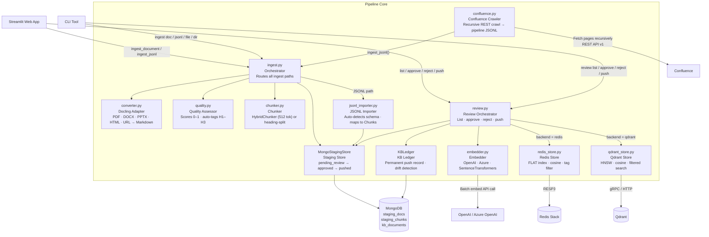
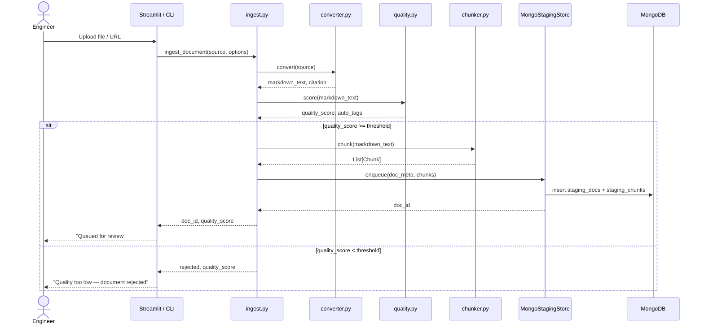
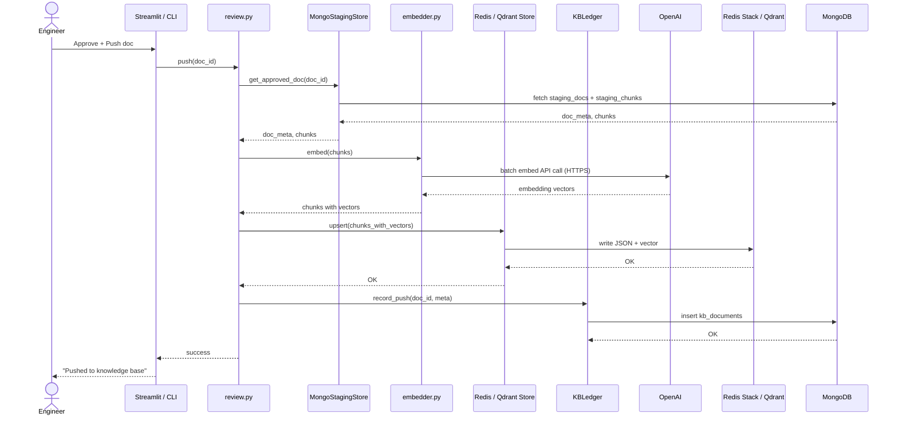

# Component — Pipeline Core

Internal components of the Pipeline Core library and how they connect.

## Component Map

```mermaid
graph TD
    ui["Streamlit Web App"]
    cli["CLI Tool"]

    subgraph core["Pipeline Core"]
        ingest["ingest.py\nOrchestrator\nRoutes all ingest paths"]
        converter["converter.py\nDocling Adapter\nPDF · DOCX · PPTX · HTML · URL → Markdown"]
        quality["quality.py\nQuality Assessor\nScores 0–1 · auto-tags H1–H3"]
        chunker["chunker.py\nChunker\nHybridChunker (512 tok) or heading-split"]
        staging["MongoStagingStore\nStaging Store\npending_review → approved → pushed"]
        jsonl_imp["jsonl_importer.py\nJSONL Importer\nAuto-detects schema · maps to Chunks"]
        confluence_c["confluence.py\nConfluence Crawler\nRecursive REST crawl → pipeline JSONL"]
        review["review.py\nReview Orchestrator\nList · approve · reject · push"]
        embedder["embedder.py\nEmbedder\nOpenAI · Azure · SentenceTransformers"]
        ledger["KBLedger\nKB Ledger\nPermanent push record · drift detection"]
        redis_s["redis_store.py\nRedis Store\nFLAT index · cosine · tag filter"]
        qdrant_s["qdrant_store.py\nQdrant Store\nHNSW · cosine · filtered search"]
    end

    mongo[("MongoDB\nstaging_docs\nstaging_chunks\nkb_documents")]
    redis_db[("Redis Stack")]
    qdrant_db[("Qdrant")]
    openai_ext["OpenAI / Azure OpenAI"]
    confluence_ext["Confluence"]

    ui -->|"ingest_document / ingest_jsonl"| ingest
    ui -->|"list / approve / reject / push"| review
    cli -->|"ingest doc / jsonl / file / dir"| ingest
    cli -->|"review list / approve / reject / push"| review

    ingest --> converter
    ingest --> quality
    ingest --> chunker
    ingest --> staging
    ingest -->|"JSONL path"| jsonl_imp
    jsonl_imp --> staging

    confluence_c -->|"ingest_jsonl()"| ingest
    confluence_c -->|"Fetch pages recursively\nREST API v1"| confluence_ext

    review --> staging
    review --> embedder
    review -->|"backend = redis"| redis_s
    review -->|"backend = qdrant"| qdrant_s
    review --> ledger

    staging --> mongo
    ledger --> mongo
    embedder -->|"Batch embed API call"| openai_ext
    redis_s -->|RESP3| redis_db
    qdrant_s -->|"gRPC / HTTP"| qdrant_db
```

## Ingest Sequence

```mermaid
sequenceDiagram
    actor Engineer
    participant UI as Streamlit / CLI
    participant Ingest as ingest.py
    participant Converter as converter.py
    participant Quality as quality.py
    participant Chunker as chunker.py
    participant Staging as MongoStagingStore
    participant MongoDB

    Engineer->>UI: Upload file / URL
    UI->>Ingest: ingest_document(source, options)
    Ingest->>Converter: convert(source)
    Converter-->>Ingest: markdown_text, citation
    Ingest->>Quality: score(markdown_text)
    Quality-->>Ingest: quality_score, auto_tags
    alt quality_score >= threshold
        Ingest->>Chunker: chunk(markdown_text)
        Chunker-->>Ingest: List[Chunk]
        Ingest->>Staging: enqueue(doc_meta, chunks)
        Staging->>MongoDB: insert staging_docs + staging_chunks
        Staging-->>Ingest: doc_id
        Ingest-->>UI: doc_id, quality_score
        UI-->>Engineer: "Queued for review"
    else quality_score < threshold
        Ingest-->>UI: rejected, quality_score
        UI-->>Engineer: "Quality too low — document rejected"
    end
```

## Review & Push Sequence

```mermaid
sequenceDiagram
    actor Engineer
    participant UI as Streamlit / CLI
    participant Review as review.py
    participant Staging as MongoStagingStore
    participant Embedder as embedder.py
    participant Store as Redis / Qdrant Store
    participant Ledger as KBLedger
    participant OpenAI
    participant VectorDB as Redis Stack / Qdrant
    participant MongoDB

    Engineer->>UI: Approve + Push doc
    UI->>Review: push(doc_id)
    Review->>Staging: get_approved_doc(doc_id)
    Staging->>MongoDB: fetch staging_docs + staging_chunks
    MongoDB-->>Staging: doc_meta, chunks
    Staging-->>Review: doc_meta, chunks
    Review->>Embedder: embed(chunks)
    Embedder->>OpenAI: batch embed API call (HTTPS)
    OpenAI-->>Embedder: embedding vectors
    Embedder-->>Review: chunks with vectors
    Review->>Store: upsert(chunks_with_vectors)
    Store->>VectorDB: write JSON + vector
    VectorDB-->>Store: OK
    Store-->>Review: OK
    Review->>Ledger: record_push(doc_id, meta)
    Ledger->>MongoDB: insert kb_documents
    MongoDB-->>Ledger: OK
    Review-->>UI: success
    UI-->>Engineer: "Pushed to knowledge base"
```
