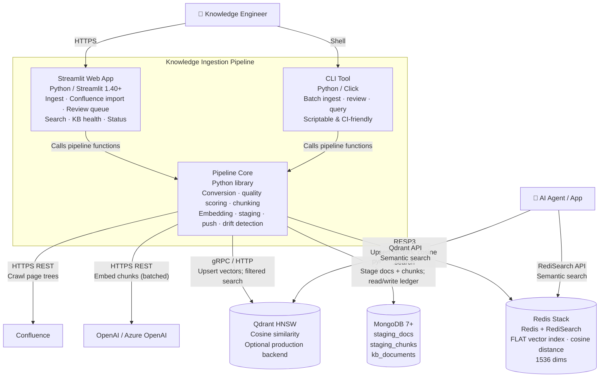

# Container — Knowledge Ingestion Pipeline

Three-layer architecture: user interfaces, pipeline core, and data stores.

```mermaid
graph TD
    engineer["👤 Knowledge Engineer"]
    consumer["👤 AI Agent / App"]

    subgraph pipeline["Knowledge Ingestion Pipeline"]
        ui["Streamlit Web App\nPython / Streamlit 1.40+\nIngest · Confluence import · Review queue\nSearch · KB health · Status"]
        cli["CLI Tool\nPython / Click\nBatch ingest · review · query\nScriptable & CI-friendly"]
        core["Pipeline Core\nPython library\nConversion · quality scoring · chunking\nEmbedding · staging · push · drift detection"]
    end

    mongo[("MongoDB 7+\nstaging_docs\nstaging_chunks\nkb_documents")]
    redis_db[("Redis Stack\nRedis + RediSearch\nFLAT vector index · cosine distance\n1536 dims")]
    qdrant_db[("Qdrant HNSW\nCosine similarity\nOptional production backend")]

    openai["OpenAI / Azure OpenAI"]
    confluence["Confluence"]

    engineer -->|HTTPS| ui
    engineer -->|Shell| cli
    ui -->|"Calls pipeline functions"| core
    cli -->|"Calls pipeline functions"| core
    core -->|"pymongo TCP\nStage docs + chunks; read/write ledger"| mongo
    core -->|"RESP3\nUpsert vectors; cosine search"| redis_db
    core -->|"gRPC / HTTP\nUpsert vectors; filtered search"| qdrant_db
    core -->|"HTTPS REST\nEmbed chunks (batched)"| openai
    core -->|"HTTPS REST\nCrawl page trees"| confluence
    consumer -->|"RediSearch API\nSemantic search"| redis_db
    consumer -->|"Qdrant API\nSemantic search"| qdrant_db
```
