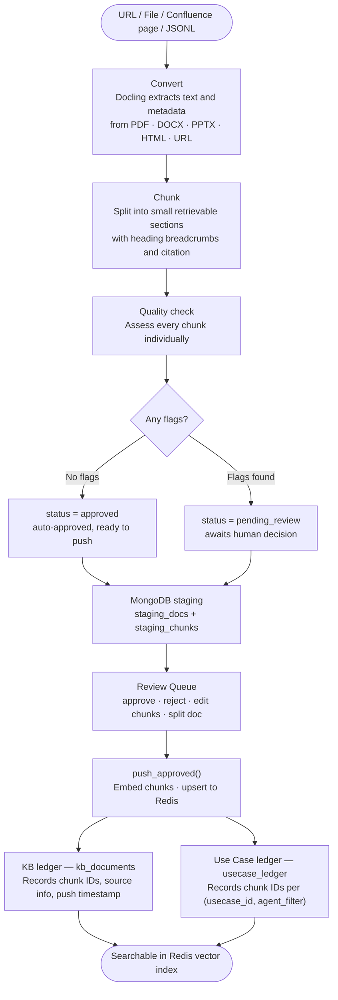
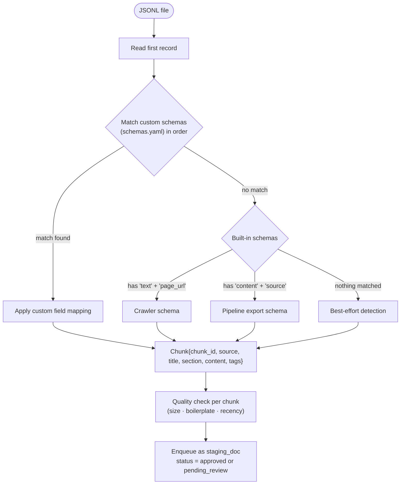
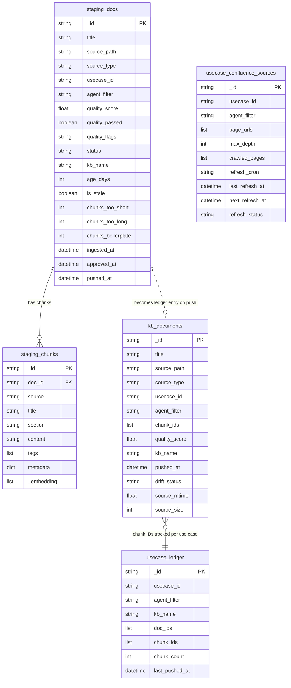
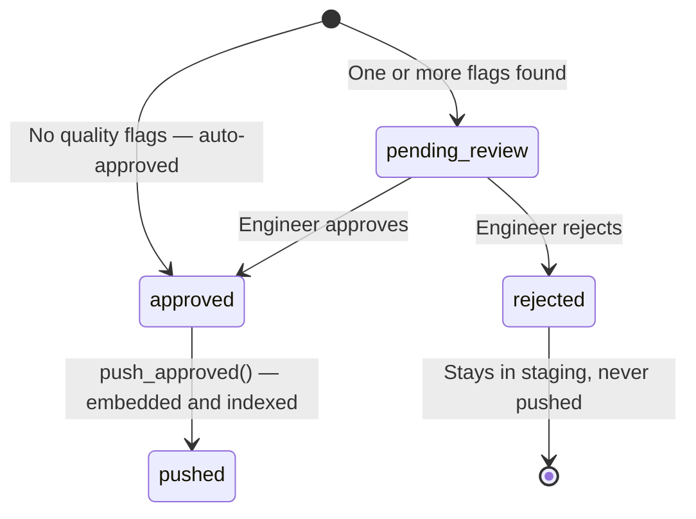
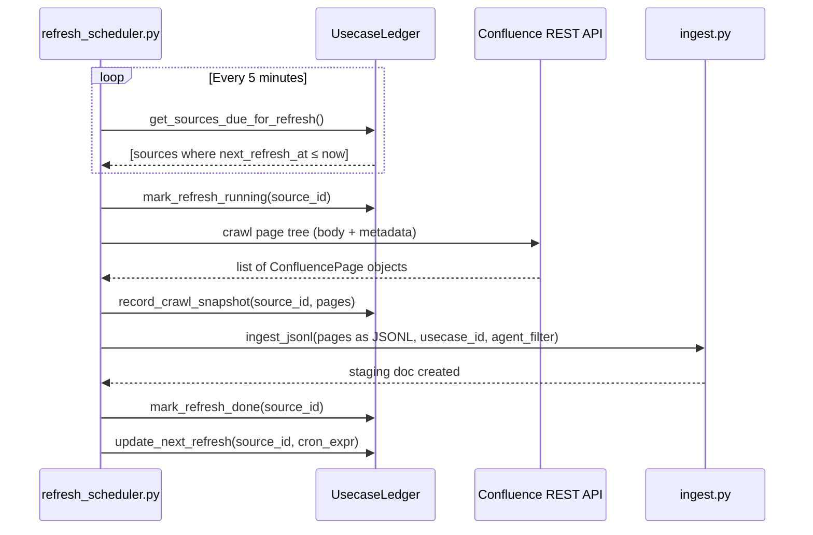

# Corpus Lifecycle — How Content Flows Through the Pipeline

This document covers how a document goes from a URL or file into the knowledge base, how the system keeps track of what's there, and how content is updated or removed over time.

---

## The core flow

---

## Quality checks

Every chunk is assessed independently after the document is split. The quality score is the fraction of chunks with no flags (0.0 – 1.0).

| Flag | Condition | Why it matters |
|---|---|---|
| **too_short** | Chunk < 100 characters | Navigation stubs and empty headings — retrieval noise |
| **too_long** | Chunk > 2 000 characters | Risk of truncation by the embedding model |
| **boilerplate** | Nav menus, TOC, login prompts, copyright footers | Adds noise, not useful for search |
| **stale** | Source > 6 months old (from creation date or file mtime) | Content may no longer be accurate |

A document is auto-approved only when it has zero flagged chunks. Any flag routes it to human review.

---

## Use case and agent tracking

Every staging document carries two fields that flow through the entire lifecycle:

- **usecase_id** — the business use case this content supports
- **agent_filter** — the specific AI agent or persona it is meant for

These are stored in `staging_docs`, written through to `kb_documents` and `usecase_ledger`, and visible in the Review Queue and Use Case Ledger UI.

The `usecase_ledger` collection maintains a live index of chunk IDs per (usecase_id, agent_filter) pair. This makes it possible to scope search results to a specific agent without re-querying the whole vector index.

---

## JSONL import

When data arrives as JSONL (from a crawler, export, or external system), the importer auto-detects the schema from the first record and maps fields to the internal `Chunk` structure.

If the JSONL file includes pre-computed `embedding` vectors, they are stored and reused at push time — no embedding API call needed.

---

## MongoDB collections

---

## Document lifecycle states

---

## Confluence sources and scheduled refresh

Confluence page trees can be registered per use case with a crawl schedule. A background scheduler (APScheduler, 5-minute poll interval) checks for sources due for refresh and re-crawls them automatically.

**Drift check (lightweight)** — separate from the full refresh, the UI can compare the stored page snapshot against the current Confluence state by fetching only version metadata (no body content). This shows which pages have been added, removed, or updated without re-crawling.

---

## Keeping the corpus healthy over time

### Adding content

Any new ingest creates new staging records. After review and push, the vector index grows incrementally — no full rebuild needed. The KB ledger records every push with a timestamp so you know exactly when each document entered the index.

### Removing content

Documents can be deleted from the KB Health page. The ledger stores chunk IDs, so removal is exact — only the selected document's vectors are deleted from the search index.

### Detecting staleness

For file-based sources: the ledger records the file's modification time and size at push time. A drift check compares the current file against the stored fingerprint.

For Confluence sources: the stored page-version snapshot is compared against current metadata from Confluence.

### Rolling back

Staging records are kept after push by default. To roll back:

1. Query `kb_documents` for documents pushed after your target date
2. Collect their `chunk_ids`
3. Delete those chunk IDs from the Redis index
4. Re-push the prior versions from staging if they're still there, or re-ingest from source

---

## Configuration

| Setting | Env var | Default | Notes |
|---|---|---|---|
| Max chunk tokens | `DOCLING_MAX_TOKENS` | `512` | HybridChunker max (≈ 400 words) |
| Max chunk chars | `CHUNK_MAX_CHARS` | `2000` | Also the "too_long" flag threshold |
| MongoDB database | `MONGODB_DB_NAME` | `knowledge_pipeline` | All collections live here |
| Collection prefix | `MONGODB_COLLECTION_PREFIX` | `""` | Separate environments, e.g. `prod_` |
| JSONL output dir | `JSONL_OUTPUT_DIR` | `./output` | Where exports are written |
