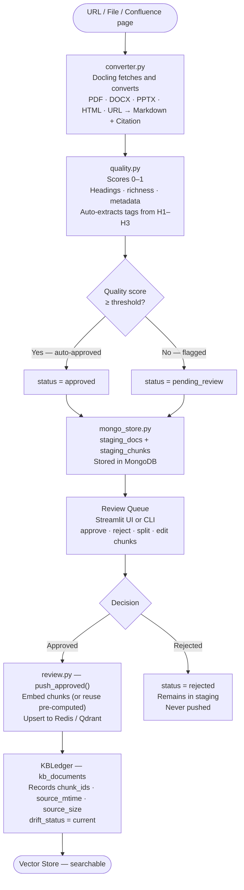
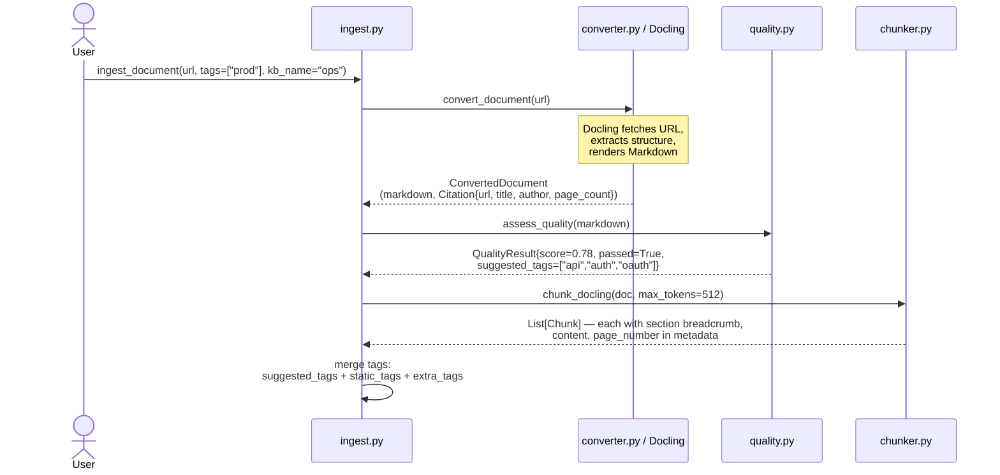
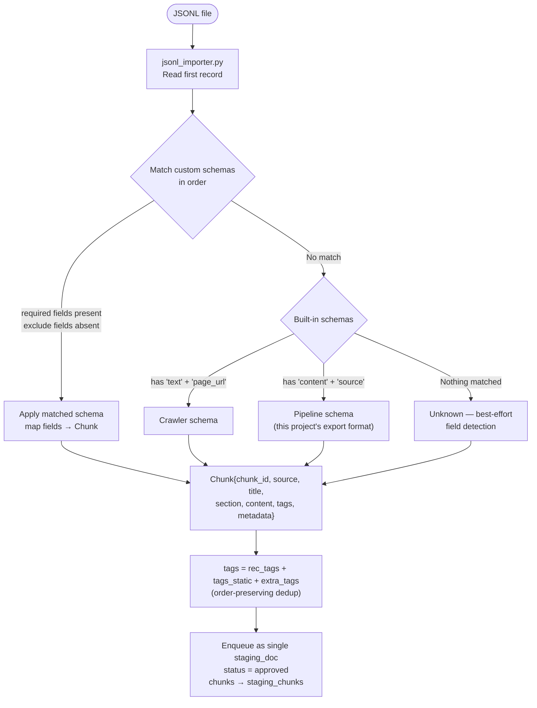
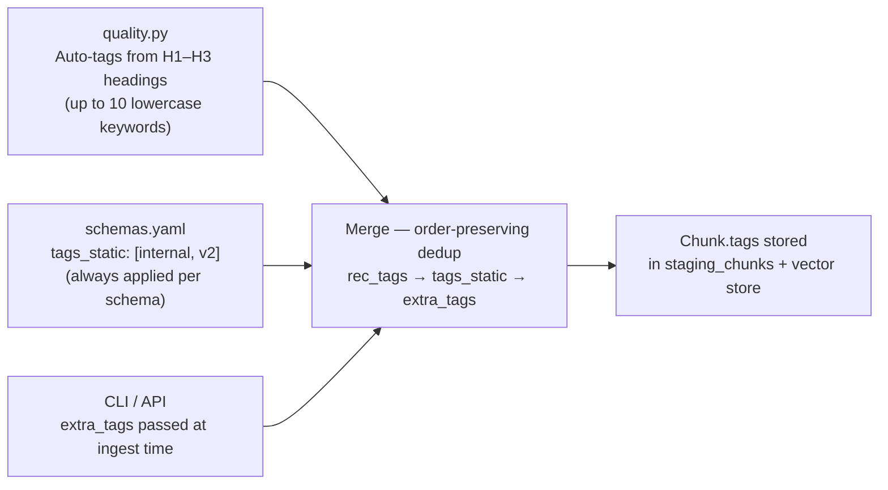
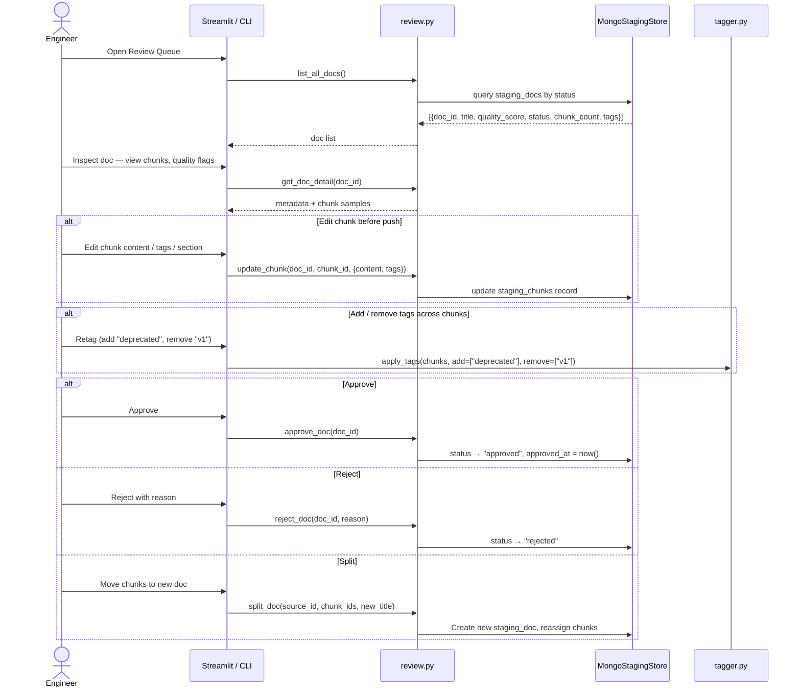
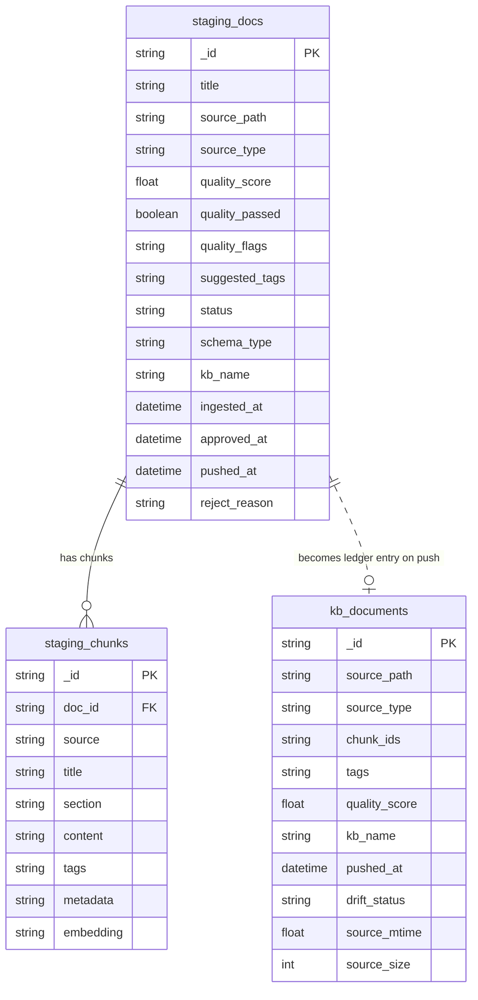
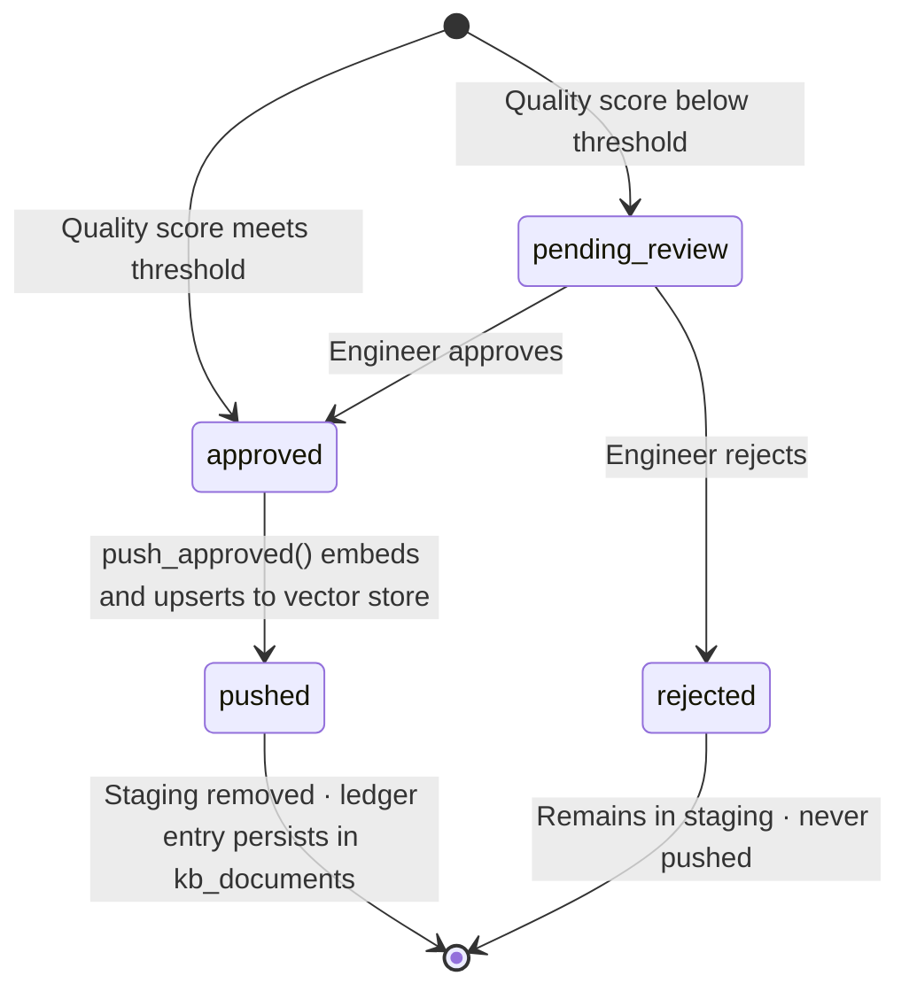
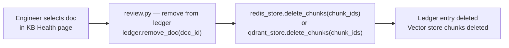
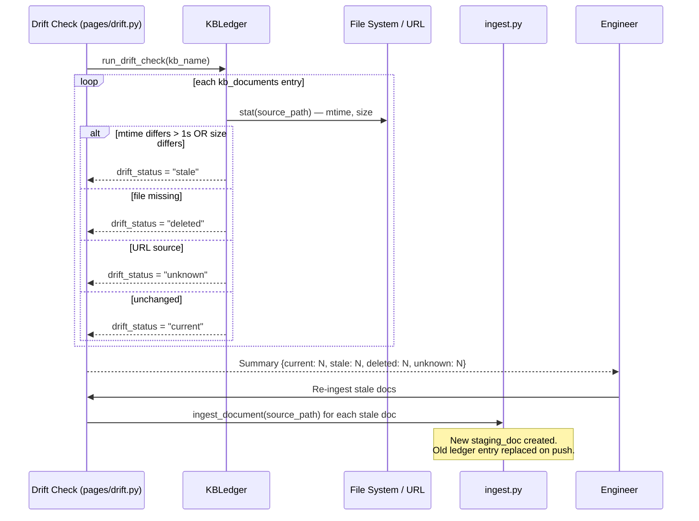
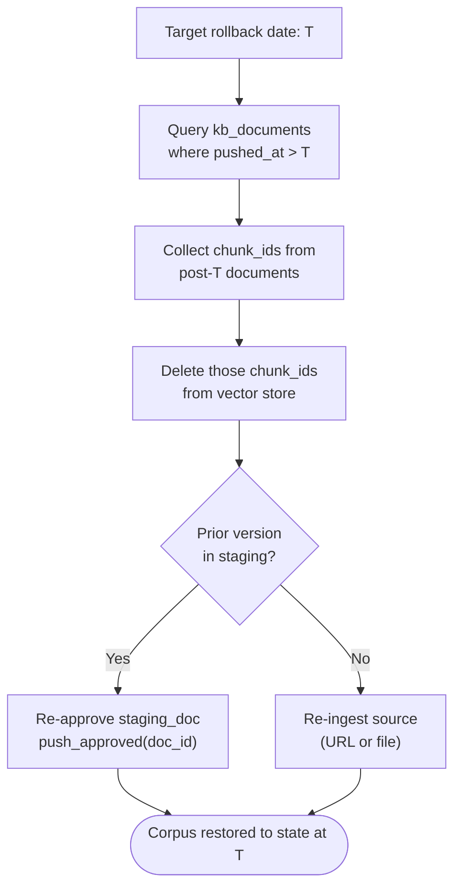

# Corpus Lifecycle Management — RAG Data Pipeline

Managing the document corpus is the most underestimated part of a production RAG system. This document covers how data flows from a URL through schema mapping, labeling, and review, ending as versioned JSONL records in MongoDB — and how that same store lets you add, prune, and roll back the corpus over time.

---

## Naive RAG vs. Managed Corpus RAG

Most RAG tutorials stop at "embed your docs and run a vector search." That approach works for demos but breaks in production.

| Dimension | Naive RAG | Managed Corpus RAG |
|---|---|---|
| **Ingestion** | Bulk embed, no review | Quality gate + human review before push |
| **Provenance** | Lost after indexing | Full citation tracked per chunk (source, page, author, date) |
| **Updates** | Re-embed everything | Drift detection — only stale/changed docs re-ingested |
| **Rollback** | Not possible | MongoDB ledger preserves prior push state; staging never deleted by default |
| **Labeling** | Manual or none | Auto-tags from headings + static tags from schema + explicit CLI tags |
| **Schema flexibility** | One format | Pluggable YAML schemas map any JSONL structure to a canonical chunk |
| **Corpus health** | Unknown | Live drift status: `current · stale · deleted · unknown` |
| **Multi-KB** | Single index | `kb_name` scopes staging, ledger, and vector index per knowledge base |

The pipeline in this repo is the managed path. MongoDB serves as the **source of truth** for what has been pushed, when, and in what state — making every operation auditable and reversible.

---

## End-to-End Flow



---

## Step 1 — Fetch URL Data

URLs (and files) enter the pipeline through `converter.py`, which wraps the Docling library to handle any format uniformly.



Every chunk carries a full `Citation` in its `metadata` field — source URL, title, author, page number — so retrieval results are always attributable.

---

## Step 2 — Apply the YAML Schema

When data arrives as JSONL (from a crawler, external system, or export), `schemas.yaml` maps the foreign field names to the canonical `Chunk` structure without writing code.

### How a schema is defined

```yaml
# schemas.yaml
schemas:
  - name: my_docs
    detect:
      required: [body, url]       # all must be present to match this schema
      exclude: [section_breadcrumbs]  # any present disqualifies the match
    fields:
      content: body               # maps "body" field → chunk content
      source: url                 # maps "url" field  → chunk source
      title: page_title
      section: category
      chunk_id: id
      tags: labels
      embedding: vector           # pre-computed vector — reused, no API call
    tags_static: [internal, v2]   # always added to every chunk
    section_join: " > "           # join list-type section fields with this
```

### Detection and mapping flow



The entire JSONL batch is stored as one `staging_doc` record, with each line becoming a row in `staging_chunks`. If the JSONL includes pre-computed `embedding` vectors, they are preserved in `_embedding` and reused at push time — no OpenAI call needed.

---

## Step 3 — Label and Review

Labeling happens automatically during ingestion but can be refined in the review queue before anything reaches the vector store.

### Tag sources (merged in order)



### Review workflow



---

## Step 4 — Store JSONL in MongoDB

MongoDB plays two distinct roles: a mutable **staging store** and a permanent **ledger**.

### Collections



### Document lifecycle



---

## Corpus Lifecycle Management

The ledger in `kb_documents` is what makes the corpus manageable over time.

### Adding documents

Any new ingest (URL, file, JSONL batch) creates new staging records. After approval and push, the ledger records the chunk IDs and source fingerprint (`mtime`, `size`). The vector store index grows incrementally — no full rebuild needed.

### Pruning documents



Chunk IDs stored in `kb_documents.chunk_ids` make targeted deletion exact — only the pruned document's vectors are removed.

### Drift detection and re-ingestion



### Reverting to a prior corpus state

The staging store is non-destructive by default (`remove_after_push=False` preserves staging records). Combined with the ledger's push timestamps, you can reconstruct what was in the corpus at any point:

1. **Query the ledger** — `kb_documents` records `pushed_at` for every document version. Filter by timestamp to see the corpus state at a given date.
2. **Identify chunks to remove** — Documents pushed after your target timestamp have `pushed_at > target`. Their `chunk_ids` can be deleted from the vector store.
3. **Re-push prior versions** — If staging records are retained, prior chunk content is still in `staging_chunks`. Re-approve and push to restore.



---

## Configuration Reference

| Setting | Env var | Default | Purpose |
|---|---|---|---|
| Quality threshold | `QUALITY_THRESHOLD` | `0.6` | Auto-approve cutoff |
| Max chunk tokens | `DOCLING_MAX_TOKENS` | `512` | HybridChunker max |
| Chunk overlap | `CHUNK_OVERLAP_CHARS` | `200` | Sliding window overlap |
| MongoDB database | `MONGODB_DB_NAME` | `knowledge_pipeline` | All collections live here |
| Collection prefix | `MONGODB_COLLECTION_PREFIX` | `""` | Scope per environment (e.g. `prod_`) |
| KB name | `--kb-name` CLI flag | `default` | Logical corpus partition |
| Vector backend | `VECTOR_BACKEND` | `redis` | `redis` or `qdrant` |
| Keep staging after push | `remove_after_push=False` | `True` | Set to False for rollback support |
