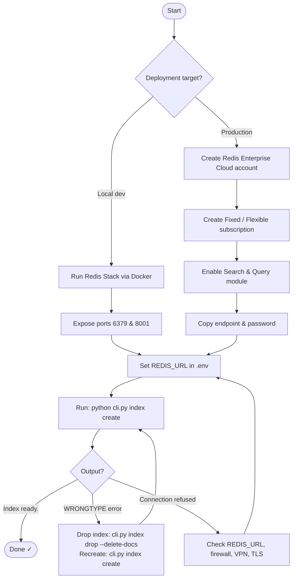
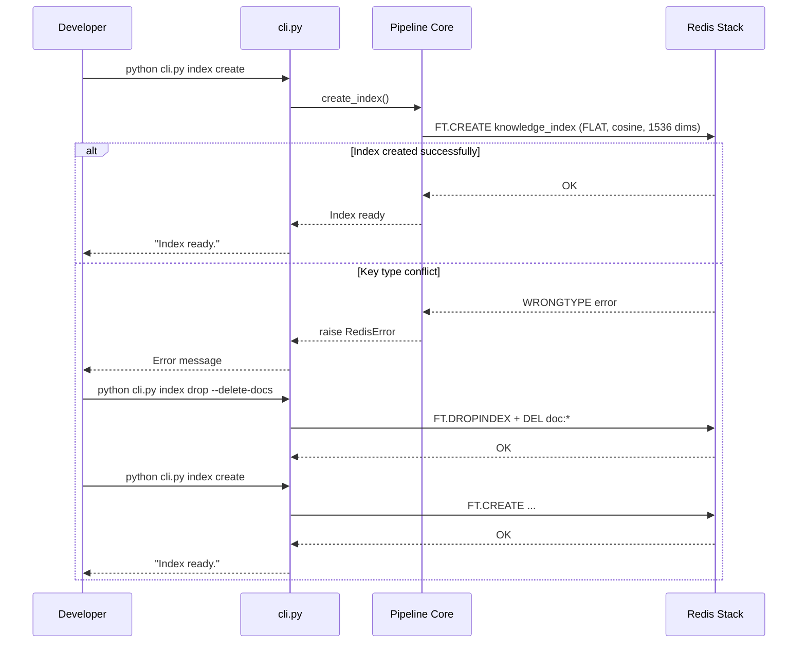

# Redis Setup Guide

This document walks through setting up Redis for use with the knowledge ingestion pipeline.

## Setup Flow



## Prerequisites

- Docker Desktop (for local testing) or a Redis Enterprise account
- Python 3.11+
- A valid OpenAI API key

## Installation

### Using Docker (local)

```bash
docker run -d \
  --name redis-stack \
  -p 6379:6379 \
  -p 8001:8001 \
  redis/redis-stack:latest
```

### Redis Enterprise Cloud

1. Create a free account at [Redis Cloud](https://redis.com/try-free/).
2. Create a **Fixed** or **Flexible** subscription.
3. Enable the **Search & Query** module on your database.
4. Copy the public endpoint and password into your `.env` file.

## Configuration

Edit `.env` in the project root:

```env
REDIS_URL=redis://:<password>@<host>:<port>
REDIS_INDEX_NAME=knowledge_index
```

## Verifying the Connection



Run the following to confirm the pipeline can reach Redis:

```bash
python cli.py index create
```

You should see:

```
Index ready.
```

## Troubleshooting

### `WRONGTYPE Operation against a key holding the wrong kind of value`

The index key type conflicts with an existing key. Drop the index and recreate:

```bash
python cli.py index drop --delete-docs
python cli.py index create
```

### Connection refused

Check that the `REDIS_URL` in `.env` is correct and that the Redis database
is reachable from your machine (firewall / VPN / TLS settings).
