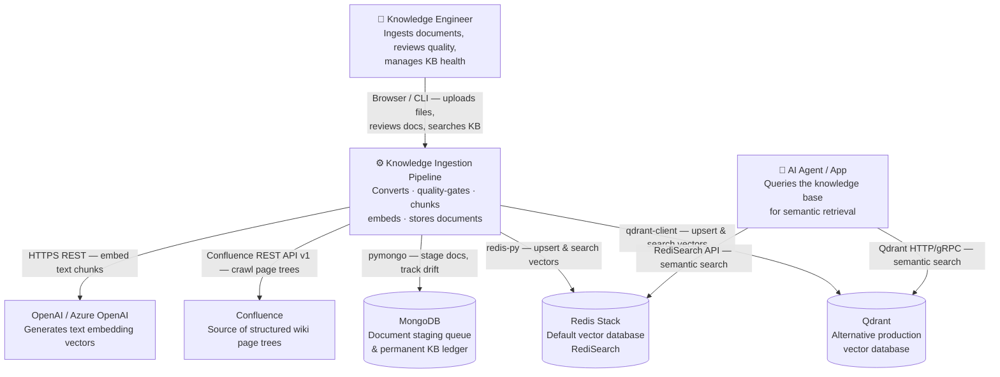

# System Context — Knowledge Ingestion Pipeline

High-level view of who and what interacts with the pipeline.

```mermaid
graph TD
    engineer["👤 Knowledge Engineer\nIngests documents, reviews quality,\nmanages KB health"]
    consumer["👤 AI Agent / App\nQueries the knowledge base\nfor semantic retrieval"]

    pipeline["⚙️ Knowledge Ingestion Pipeline\nConverts · quality-gates · chunks\nembeds · stores documents"]

    openai["OpenAI / Azure OpenAI\nGenerates text embedding vectors"]
    confluence["Confluence\nSource of structured wiki page trees"]
    mongodb[("MongoDB\nDocument staging queue\n& permanent KB ledger")]
    redis[("Redis Stack\nDefault vector database\nRediSearch")]
    qdrant[("Qdrant\nAlternative production\nvector database")]

    engineer -->|"Browser / CLI — uploads files,\nreviews docs, searches KB"| pipeline
    pipeline -->|"HTTPS REST — embed text chunks"| openai
    pipeline -->|"Confluence REST API v1 — crawl page trees"| confluence
    pipeline -->|"pymongo — stage docs, track drift"| mongodb
    pipeline -->|"redis-py — upsert & search vectors"| redis
    pipeline -->|"qdrant-client — upsert & search vectors"| qdrant
    consumer -->|"RediSearch API — semantic search"| redis
    consumer -->|"Qdrant HTTP/gRPC — semantic search"| qdrant
```
