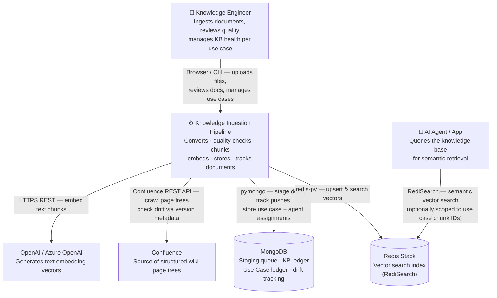

# System Context — Knowledge Ingestion Pipeline

High-level view of who and what interacts with the pipeline.

## Key concepts

**Use case ID + Agent filter** — every document is tagged with which business use case it supports and which AI agent it's meant for. This flows from ingestion through the review step and into the knowledge base ledger, so search results can be scoped and the health of each use case can be tracked independently.

**Staging vs. live** — nothing reaches the vector index without going through MongoDB staging first. Documents sit in staging (pending, approved, pushed) so they can be reviewed, edited, or rejected before they affect search results.

**Confluence drift** — the pipeline stores a page-version snapshot after each crawl. A lightweight drift check (metadata only, no body fetch) can then detect added, removed, or updated pages without re-crawling everything.

**KB ledger** — MongoDB records every push event with chunk IDs, source fingerprints, and timestamps. This makes it possible to detect staleness, audit what's in the index, and roll back if needed.
